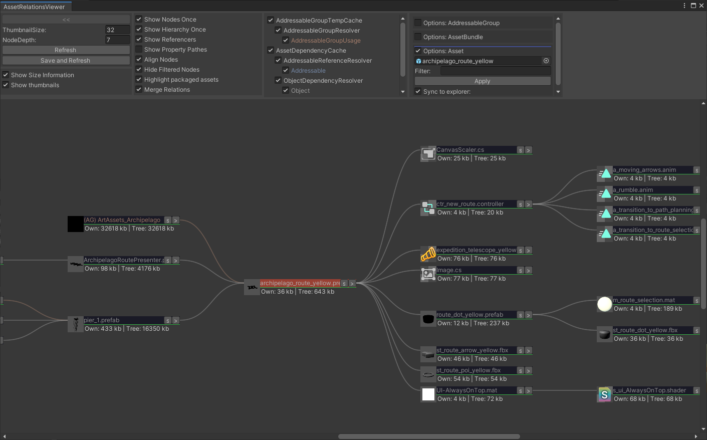
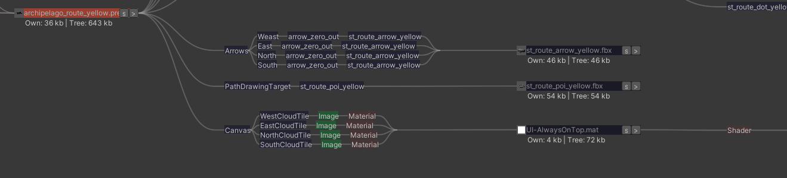

# asset-relations-viewer

Plugin to display dependencies between assets in a tree based view within the Unity editor.



<br><br><br><br>
## Features

* Standalone Editor UI without any external dependencies
* View which dependencies an asset has to other assets
* View which assets have the given asset as a dependency
* Show thumbnails of all assets in the dependency tree
* filter for Asset Names and Asset Types in displayed tree
* Highlight if an asset is used in the project (going to be packed in the app)
* Show path of where an asset is used exactly within a scene, prefab or asset
* Display byte size of compressed asset together with overall size of dependency tree
* Extendable by own dependency resolvers, for example to show addressables
* Support additional connection- and nodetypes which can be added via addons, for example:
	* Addressable Groups
	* Addressables
	* AssetBundles
	* LocaKeys
	* Etc.

<br><br><br><br>
## Installation

#### For Unity 2018.3 or later (Using Unity Package Manager)

Find the manifest.json file in the packages folder of your project and edit it to look like this:
```js
{
  "dependencies": {
    "com.innogames.asset-relations-viewer": "https://github.com/innogames/asset-relations-viewer.git",
    ...
  },
}
```

If you are in production and not want to get automatic updates always use a tagged version like:

```js
	...
    "com.innogames.asset-relations-viewer": "https://github.com/innogames/asset-relations-viewer.git#1.3.0",
    ...

```

<br><br><br><br>
## First Usage

1. Select an asset within the unity project explorer
2. Right click to open context menu for an asset
3. Select "Show in Asset Relations Viewer"
4. On Dialog for the first startup of AssetRelationsViewer click on yes
5. Wait for the resolver to find all dependencies for all assets in the project which can take a while for a large project with many assets

<br><br><br><br>
## Controls

#### Menu items

Menu items sorted from left to right

<br>

**Back button ("<<")**: Button to go back to previous selected asset to view

**Thumbnail Size**: Size of the shown thumbnail in pixels

**Node Depth**: Depth of the shown tree structure

**Refresh**: Refreshed view after asset has changed

**Save and Refresh**: Saves the project before refreshing the view to make sure all changes are applied to assets before

**Show Size Information**: Displays additional information for bytesize of asset on each node

**Show Thumbnails**: Shown correct thumbnails on nodes if available

**Show nodes Once**: To only show each node (Asset) once within the displayed tree

**Show hierarchy Once**: To only show the same dependency hierarchy for an asset once within the displayed tree

**Show referencers**: If referencers (Assets that have the selected asset as a dependency) should be shown or not

**Show Property Pathes**: If path of where the dependency is within the scene, prefab, scriptable object is shown

**Align Nodes**: If all nodes if the same depth should be align horizontally in the displayed tree 

**Hide Filtered Nodes**: Hide all nodes that are filtered out instead of just graying them out

**Highlight packaged assets**: Adds green highlight to nodes which are going to be packed into the app (Are actually used by the game)

**Merge Relations**: If an asset has the same asset as a dependency multiple times, the same dependency is just shown once


#### Asset Options
Options specific to assets

**Selected Asset**: The asset the current dependency tree is shown for

**Filter**: To filter for names or types within the displayed tree (Usage same as filter in project explorer)

**Sync to explorer**: If selected the currently selected asset in the project explorer will be the one shown in the AssetRelationsViewer

#### Node


**s**: If the selected node in an asset, it will be selected in the unity project explorer

**>**: Makes the clicked on node the current viewed node in the AssetRelationsViewer

<br><br><br><br>

## AssetDependencyCache
The AssetDependencyCache finds and stores asset->asset dependencies. 
To speed up loading the timestamps and dependencies of all assets in the project are saved to a file so only changed files have to be checked for their dependencies again.

### Resolvers
The AssetDependencyCache supports different resolvers to find dependencies for assets. 
By default only the ObjectSerializedDependencyResolver which only finds hard linked asset->asset dependencies is supported, but additional ones can be added to also find asset->asset references by Addressables for example.

#### ObjectSerializedDependencyResolver
Uses own implementation which is based on SerializedObjects and SerializedProperties to find assets and other dependency types.
Since this solution is based on an own dependency search implementation, it is much slower than the ObjectDependencyResolver.

## AssetToFileDependencyCache
To enable subassets to be supported by the AssetRelationsViewer assets needed to be split into asset and file nodes since a file can have multiple assets like fbx files for example.
In order to see in which file an asset is the AssetToFileDependencyCache needs to be activated

### Resolvers
The AssetToFileDependencyCache only supports the AssetToFileDependencyResolver. It is currently not intended to be extendable with additional resolvers.

#### AssetToFileDependencyResolver
Shows dependencies between assets and the files they are contained in.

## OpenSceneDependencyCache
Temporary cache to store gameobject->gameobject dependencies inside a scene.
When its activated one can click on any gameobject in the scene hierarchy so select it. After that in the Options: InScene menu one can click on "Select" to then view it in the AssetRelationsViewer.
Note that after switching or updating a scene you need to click on "Refresh" in the AssetRelationsViewer to view the current scene dependencies. 

### Resolvers
The OpenSceneDependencyCache only supports the InSceneDependencyResolver. It is currently not intended to be extendable with additional resolvers.

#### InSceneDependencyResolver
The InSceneDependencyResolver finds gameobject->gameobjects dependencies within the opened scene or prefab.  

<br><br><br><br>
## Showing dependency pathes
If one wants to know where exactly in a scene, prefab, scriptable object a reference is done the "ObjectSerializedDependencyResolver" needs to be active and "Show Property Pathes" in the menu needs to be active.
Once active the whole path of the dependency (GameObject->Components->ClassMemberVariable) is shown.

#### Showing "Unknown Path" path nodes
First make sure to the ObjectSerializedDependencyResolver is activated since the ObjectDependencyResolver cant find any pathes so "Unknown path" is shown.
Also, if the ObjectSerializedDependencyResolver and ObjectDependencyResolver are active at the same time the ObjectDependencyResolver can find dependencies that the ObjectSerializedDependencyResolver didnt find. 
This relates to the already mentioned issue with nested prefabs and the AssetDatabase.GetDependencies() function.




<br><br><br><br>
## Troubleshooting
There can be cases where no tree is shown in the AssetRelationsViewer

* Make sure a node (Asset) is selected to be shown
* Make sure a dependency cache (AssetDependencyCache) and dependency resolver (ObjectDependencyResolver) is selected, otherwise no dependency can be found
* After a  code recompile the dependency cache needs to be updated by clicking on "Refresh"

<br><br><br><br>
## Addons
Support to display different connection and node types can be added by addons.

#### Addressable system
An addon is available to add support for showing addressables and also addressable groups from Unitys Addressables system.
The Package is called asset-relations-viewer-addressables.
It can be found at https://github.com/innogames/asset-relations-viewer-addressables

#### Writing own addons to support custom connection- and nodetypes
Own addons can be also added so custom dependencies with any nodetype and dependency type can be added to be viewed inside the Asset Relations Viewer. 
For seing how to add own addons, please have a look at the Addressable sytem addon source code. 

